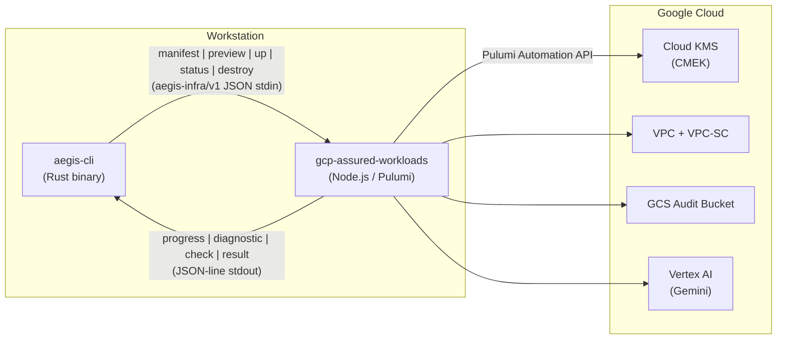
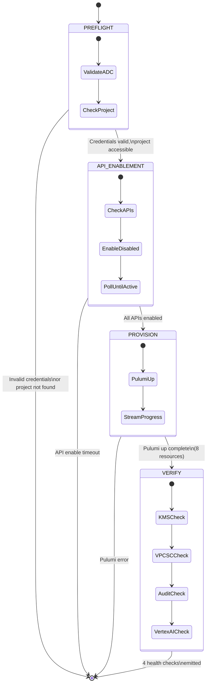
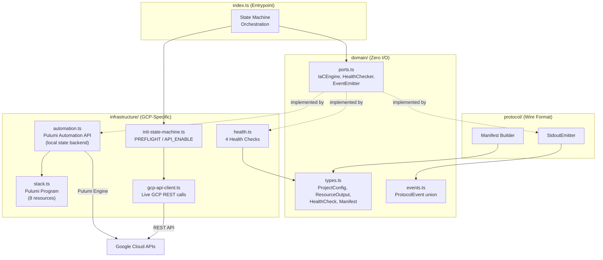

# gcp-assured-workloads

[](https://github.com/rtmx-ai/gcp-assured-workloads/actions/workflows/ci.yml)
[](LICENSE)
[](.nvmrc)
[](https://github.com/rtmx-ai/aegis-infra-sdk/blob/main/PLUGIN_GUIDE.md)
[](https://github.com/rtmx-ai/aegis-infra-sdk)

IL4/IL5 Assured Workloads boundary plugin for [aegis-cli](https://github.com/rtmx-ai/aegis-cli). Provisions a hardened GCP environment with Vertex AI Gemini access for CUI (Controlled Unclassified Information) workloads.

## How It Works

aegis-cli invokes this plugin as a subprocess during `aegis init`, `aegis doctor`, and `aegis destroy`. The user never interacts with this plugin directly.



### Initialization State Machine

The `up` subcommand executes a four-phase state machine that handles the full lifecycle from raw GCP credentials to a verified boundary:



Each phase is idempotent. Re-running `up` from any interruption point converges to the same end state.

### Provisioned Resources

| # | Resource | Purpose |
|---|----------|---------|
| 1 | Cloud KMS KeyRing | CMEK foundation |
| 2 | Cloud KMS CryptoKey | 30-day rotation, encrypts all data at rest |
| 3 | CryptoKey IAM Binding | Grants GCS service agent CMEK access |
| 4 | VPC Network | Isolated network with Private Google Access |
| 5 | Subnet | us-central1, flow logging enabled |
| 6 | VPC-SC Perimeter | API firewall around aiplatform.googleapis.com (requires accessPolicyId) |
| 7 | IAM Audit Config | DATA_READ, DATA_WRITE, ADMIN_READ logging |
| 8 | GCS Audit Bucket | Versioned, CMEK-encrypted, 365-day lifecycle |

### Health Checks (status subcommand)

| Check | What It Validates |
|-------|-------------------|
| kms_key_active | CMEK key exists, is ENABLED, rotation current |
| vpc_sc_enforced | VPC-SC perimeter configured and active |
| audit_sink_flowing | Audit bucket exists |
| vertex_ai_accessible | Authenticated Vertex AI model access via ADC |

## Prerequisites

- Node.js >= 22 (pinned via `.nvmrc`)
- Pulumi CLI >= 3.181.0
- GCP Application Default Credentials (`gcloud auth application-default login`)

## Quick Start

```bash
nvm use
npm install
npm run build

# Discover plugin capabilities
node dist/index.js manifest

# Preview (dry run)
node dist/index.js preview --input '{"project_id":"my-project","region":"us-central1","impact_level":"IL4"}'

# Provision boundary
node dist/index.js up --input '{"project_id":"my-project","region":"us-central1","impact_level":"IL4"}'

# Check boundary health
node dist/index.js status --input '{"project_id":"my-project","region":"us-central1","impact_level":"IL4"}'

# Tear down (requires confirmation flag)
node dist/index.js destroy --confirm-destroy --input '{"project_id":"my-project","region":"us-central1","impact_level":"IL4"}'
```

## Plugin Protocol (aegis-infra/v1)

All subcommands emit newline-delimited JSON to stdout. Stderr is reserved for debug logs.

**Event types:**

```jsonl
{"type":"diagnostic","severity":"info","message":"Entering state: PREFLIGHT"}
{"type":"progress","resource":"gcp:kms:KeyRing","name":"aegis-keyring","operation":"create","status":"complete"}
{"type":"check","name":"kms_key_active","status":"pass","detail":"aegis-cmek-key is ENABLED"}
{"type":"result","success":true,"outputs":{"vertex_endpoint":"us-central1-aiplatform.googleapis.com"}}
```

## Architecture

Hexagonal architecture with injectable ports for all external dependencies:



All GCP API calls go through the `GcpApiClient` port interface, making every phase testable at Tier 1 with mocks.

## Development

```bash
npm run build          # TypeScript compilation
npm run lint           # ESLint
npm run format         # Prettier check
npm test               # All tests
npm run test:unit      # Tier 1 unit tests only
```

Pre-commit hook (husky) runs format, lint, build, and unit tests on every commit.

## Requirements Traceability

Requirements are tracked in `.rtmx/` using the RTMX standard. Each requirement includes BDD scenarios, TDD test signatures, and traceability to upstream aegis-cli requirements.

| Req ID | Category | Title |
|--------|----------|-------|
| REQ-GCG-001 | PROTOCOL | aegis-infra/v1 Plugin Contract |
| REQ-GCG-002 | INFRA | GCP Assured Workloads Boundary Provisioning |
| REQ-GCG-003 | STATUS | Boundary Health Status Checks |
| REQ-GCG-004 | INFRA | Local Pulumi State Backend |
| REQ-GCG-005 | INFRA | Initialization State Machine |
| REQ-GCG-006 | INFRA | Unified State Machine for All Subcommands |
| REQ-GCG-007 | STATUS | VPC-SC Perimeter Validation and Vertex AI Model Access |
| REQ-GCG-008 | INFRA | Pre-commit Hook Enforcement |

## License

MIT
