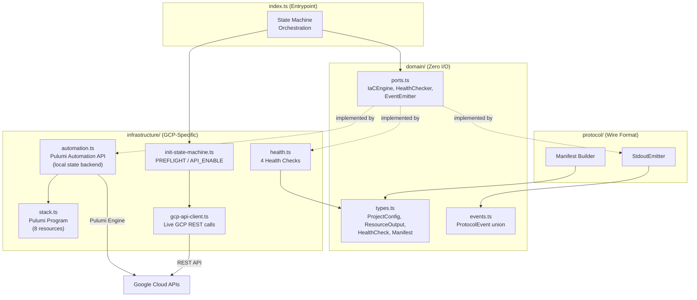
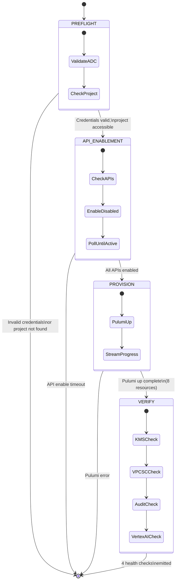

# Architecture

The plugin follows a hexagonal architecture with injectable ports for all external dependencies. This makes every phase testable at Tier 1 with mocks -- no GCP credentials or network access required for unit tests.

## Hexagonal Architecture

## Plugin File Structure

The plugin consumes `@aegis-cli/infra-sdk` which provides protocol handling, lifecycle management, and CLI dispatch. The plugin itself implements three port interfaces:

| File | Port Interface | Responsibility |
|------|---------------|----------------|
| `src/index.ts` | -- | Declarative entrypoint: single `createPluginCli()` call |
| `src/csp-client.ts` | `CspClient` | GCP credential validation, project access, API enablement, VPC-SC auto-discovery |
| `src/engine.ts` | `IaCEngine` | Pulumi Automation API wrapper (preview, up, destroy, getOutputs) |
| `src/health.ts` | `HealthChecker` | 4 GCP health checks (KMS, VPC-SC, audit, Vertex AI) |
| `src/stack.ts` | -- | Pulumi program definition (8 GCP resources) |
| `src/fetch-retry.ts` | -- | Resilient HTTP client with exponential backoff, domain allowlist |
| `src/token-cache.ts` | -- | ADC token caching with expiry-aware refresh |

All protocol, state machine, and CLI parsing code lives in `@aegis-cli/infra-sdk`. The plugin contains only GCP-specific logic.

## Initialization State Machine

The `up` subcommand executes a four-phase state machine:

Each phase is idempotent. Re-running `up` from any interruption point converges to the same end state.

## Provisioned Resources

| # | Resource | Purpose |
|---|----------|---------|
| 1 | Cloud KMS KeyRing | CMEK foundation |
| 2 | Cloud KMS CryptoKey | 30-day rotation, encrypts all data at rest |
| 3 | CryptoKey IAM Binding | Grants GCS service agent CMEK access |
| 4 | VPC Network | Isolated network with Private Google Access |
| 5 | Subnet | us-central1, flow logging enabled |
| 6 | VPC-SC Perimeter | API firewall around aiplatform.googleapis.com (requires accessPolicyId) |
| 7 | IAM Audit Config | DATA_READ, DATA_WRITE, ADMIN_READ logging |
| 8 | GCS Audit Bucket | Versioned, CMEK-encrypted, 365-day lifecycle |

All resources are tagged with compliance labels: `aegis-managed=true`, `impact-level=<il4|il5>`, `compliance-framework=nist-800-171`.

## Health Checks

The `status` subcommand runs 4 health checks in parallel:

| Check | What It Validates |
|-------|-------------------|
| `kms_key_active` | CMEK key exists, is ENABLED, rotation period is set |
| `vpc_sc_enforced` | VPC-SC perimeter configured and VPC network active |
| `audit_sink_flowing` | Audit bucket exists in the project |
| `model_accessible` | Authenticated Vertex AI model access via ADC; validates the exact `generateContent` endpoint that aegis-cli will use |

Each check returns one of three statuses: `pass`, `fail`, or `warn`. A `warn` status indicates insufficient permissions to perform the check rather than a definitive failure.

## Pulumi State

Pulumi state is stored locally at `~/.aegis/state/gcp-assured-workloads/` using the file backend. This plugin is designed as a local dev tool (single user, single workstation) so remote locking is not required. The state contains only resource routing metadata -- no secrets, tokens, or CUI.

State integrity is protected by HMAC to detect tampering outside of normal Pulumi operations.

## Security Controls

- **Domain allowlist:** All outbound HTTP calls are restricted to `*.googleapis.com`, `oauth2.googleapis.com`, and `accounts.google.com`. Requests to any other domain are blocked to prevent token exfiltration.
- **Output validation:** All stack outputs are validated against regex patterns before emission.
- **Retry with backoff:** Transient failures (408, 429, 5xx, network errors) are retried with exponential backoff and jitter. Permanent errors (400, 401, 403, 404) are not retried.
- **TLS verification:** TLS certificate errors produce actionable diagnostics (e.g., suggesting `NODE_EXTRA_CA_CERTS` for corporate proxies).
- **Token caching:** ADC tokens are cached and refreshed 5 minutes before expiry to avoid unnecessary re-authentication.
