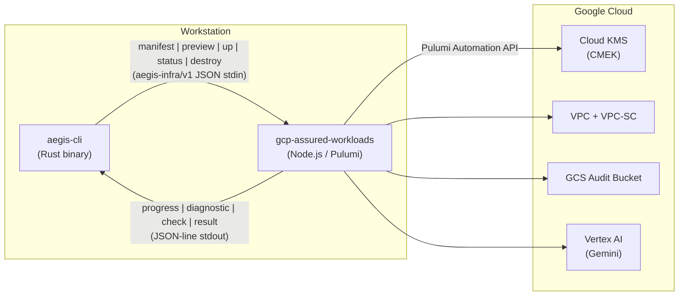

# GCP Assured Workloads Plugin

The `gcp-assured-workloads` plugin provisions a hardened GCP environment for Controlled Unclassified Information (CUI) workloads. It implements the `aegis-infra/v1` contract and is invoked by [aegis-cli](https://github.com/rtmx-ai/aegis-cli) as a subprocess -- the user never interacts with this plugin directly.

## Who Is This For?

This plugin is for organizations that need to run Vertex AI Gemini workloads under IL4 or IL5 compliance requirements. It automates the provisioning of an Assured Workloads boundary with defense-in-depth controls including CMEK encryption, VPC Service Controls, audit logging, and network isolation.

## What It Provisions

The plugin creates 8 GCP resources that together form a compliant boundary:

| # | Resource | Purpose |
|---|----------|---------|
| 1 | Cloud KMS KeyRing | CMEK foundation |
| 2 | Cloud KMS CryptoKey | 30-day rotation, encrypts all data at rest |
| 3 | CryptoKey IAM Binding | Grants GCS service agent CMEK access |
| 4 | VPC Network | Isolated network with Private Google Access |
| 5 | Subnet | us-central1, flow logging enabled |
| 6 | VPC-SC Perimeter | API firewall around aiplatform.googleapis.com (requires accessPolicyId) |
| 7 | IAM Audit Config | DATA_READ, DATA_WRITE, ADMIN_READ logging |
| 8 | GCS Audit Bucket | Versioned, CMEK-encrypted, 365-day lifecycle |

## Health Checks

The plugin exposes 4 health checks via the `status` subcommand:

| Check | What It Validates |
|-------|-------------------|
| kms_key_active | CMEK key exists, is ENABLED, rotation current |
| vpc_sc_enforced | VPC-SC perimeter configured and active |
| audit_sink_flowing | Audit bucket exists |
| model_accessible | Authenticated Vertex AI model access via ADC (validates exact generateContent endpoint) |

## Four-Phase State Machine

The `up` subcommand executes a four-phase state machine that handles the full lifecycle from raw GCP credentials to a verified boundary:

1. **PREFLIGHT** -- Validates ADC credentials and checks project access.
2. **API_ENABLEMENT** -- Ensures all required GCP APIs are enabled (compute, KMS, storage, IAM, resource manager, access context manager).
3. **PROVISION** -- Runs the Pulumi Automation API to create or update all 8 resources.
4. **VERIFY** -- Executes all 4 health checks to confirm the boundary is operational.

Each phase is idempotent. Re-running `up` from any interruption point converges to the same end state.

## Plugin Communication

aegis-cli communicates with this plugin over a JSON-line protocol on stdin/stdout:

Five subcommands are supported:

| Command | Purpose |
|---------|---------|
| `manifest` | Declare inputs, outputs, and version |
| `preview` | Dry-run of planned changes |
| `up` | Provision resources |
| `status` | Health check of live boundary |
| `destroy` | Tear down all managed resources |
